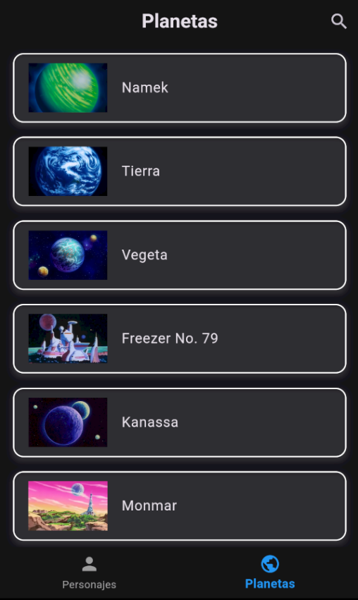

# Dragon Ball Character Viewer

Este proyecto es una aplicación Flutter que consume la API de Dragon Ball (`dragonball-api.com`) para mostrar información sobre personajes y planetas del universo de Dragon Ball. Utiliza `Provider` para la gestión del estado y la arquitectura de la aplicación. A continuación, se detalla cómo está estructurada la aplicación.

## Descripción del Proyecto

La aplicación permite a los usuarios explorar personajes de Dragon Ball y sus planetas de origen. Los usuarios pueden:

- **Ver una lista de personajes**: La pantalla principal muestra una lista de personajes, cada uno con una imagen y nombre.
- **Ver detalles de un personaje**: Al seleccionar un personaje, se abre una nueva pantalla que muestra información detallada sobre el personaje, incluyendo su imagen, raza, género, afiliación, origen, y una descripción.
- **Ver detalles de un planeta**: En la pantalla de detalles del personaje, los usuarios pueden ver información sobre el planeta de origen del personaje y navegar a una pantalla de detalles del planeta.
- **Ver transformaciones**: Si un personaje tiene transformaciones, estas se muestran en una lista. Al seleccionar una transformación, se muestra una imagen de la transformación en un overlay.

## Estructura del Proyecto

- **`lib/models/character_base_model.dart`**: Define el modelo base para los personajes.
- **`lib/models/character_detail_model.dart`**: Define el modelo para los detalles del personaje.
- **`lib/provider/api_provider.dart`**: Gestiona la llamada a la API y el estado de los datos de personajes y planetas.
- **`lib/screens/planet_detail_screen.dart`**: Muestra la información detallada sobre un planeta.
- **`lib/screens/character_detail_screen.dart`**: Muestra la información detallada sobre un personaje, incluyendo un overlay para visualizar imágenes de transformaciones.

### Lista de Personajes

### Detalle del Personaje

### Transformación del Personaje

### Lista de Planetas

### Detalle del Planeta

